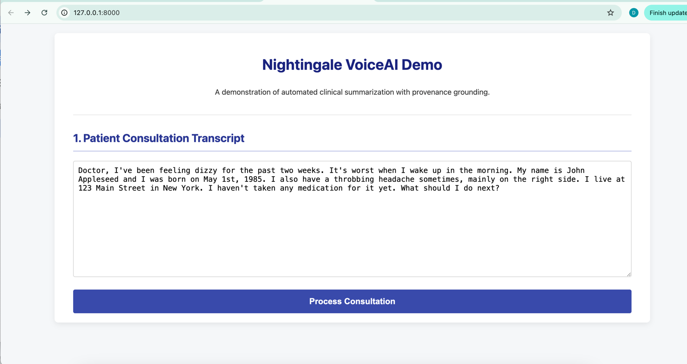
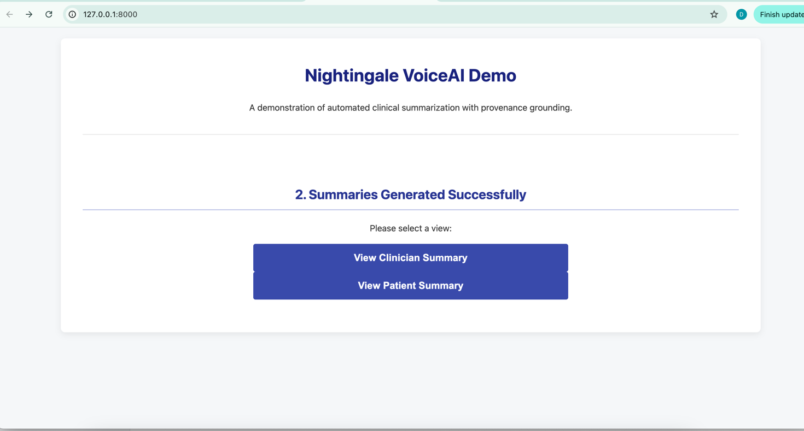
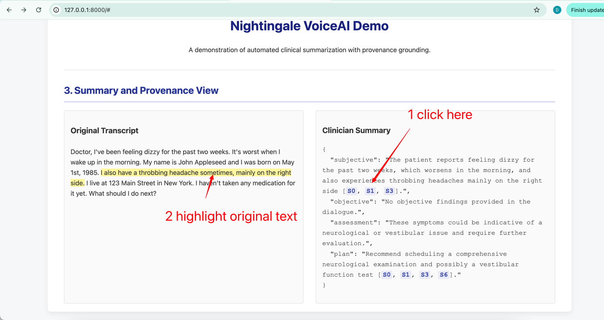

# Nightingale - VoiceAI Patient Experience Prototype

## 1. Objective
This project is a fully functional prototype created for the Nightingale 48-hour build challenge. It aims to enhance the complete patient experience from **pre-consultation** to **in-consultation** and **post-consultation** through a **voice-first clinical workflow**. The project strictly adheres to three core principles: **Privacy**, **Provenance**, and **Low Latency**.


## 2. Key Features
- **Authentication & Informed Consent**: The API interface mandates obtaining the patient's informed consent before processing any data.
- **Automatic PHI Redaction**: The built-in `spaCy` module can automatically identify and redact Protected Health Information (PHI) in text, ensuring the security of logs and downstream systems.
- **Dual Summary Generation**: A single conversation can generate a structured SOAP-format summary for **clinicians** and a friendly, actionable summary for **patients**.
- **Provenance**: Key information in each summary is linked back to specific sentences in the original conversation via `[S#]` anchors, enabling complete verifiability.
- **Modularity & Testability**: The project adopts a clear modular structure, accompanied by unit tests (`pytest`) to ensure the correctness of core functions.


## 3. API Documentation and Demonstration
This project is built with FastAPI and comes with an interactive API documentation (Swagger UI). After starting the service, you can visit the following address for real-time API testing and interaction:  
**[http://127.0.0.1:8000/docs](http://127.0.0.1:8000/docs)**  


This project includes an interactive web interface to intuitively demonstrate the core "Provenance" feature.





*(Demo above: After clicking the `[S#]` anchor in the summary on the right, the corresponding sentence in the original text on the left will automatically scroll into view and be highlighted.)*


## 4. Tech Stack
- **Backend Framework**: FastAPI
- **Database**: SQLite (interacted with via SQLAlchemy ORM)
- **AI & NLP**:
  - Summary Generation: OpenAI GPT-3.5-Turbo
  - PHI Redaction: `spaCy` (using the `en_core_web_sm` model)
- **API Interaction & Validation**: Pydantic
- **Testing Framework**: Pytest


## 5. Project Structure
```
nightingale_build/
├── app/                  # Core application code
│   ├── api/              # API endpoint logic
│   ├── core/             # Core business logic (redaction, summarization)
│   ├── db/               # Database models and session management
│   ├── schemas/          # Pydantic data validation models
│   └── main.py           # FastAPI application entry point
├── tests/                # Unit tests
├── .gitignore
├── Attribution.txt       # Third-party library attributions
├── README.md             # Project description
└── requirements.txt      # Python dependencies
```


## 6. Installation and Run
1. **Clone the Repository**:
   ```bash
   git clone <git@github.com:boots-coder/nightingale_build.git>
   cd nightingale_build
   ```

2. **Create and Activate Conda Environment**:
   ```bash
   conda create --name nightingale python=3.10 -y
   conda activate nightingale
   ```

3. **Install Dependencies**:
   ```bash
   pip install -r requirements.txt
   python -m spacy download en_core_web_sm
   ```

4. **Set OpenAI API Key (Important!)**:
   ```bash
   # On macOS/Linux
   export OPENAI_API_KEY='your_real_api_key'
   ```

5. **Start the Service**:
   ```bash
   uvicorn app.main:app --reload
   ```
   The service will run at `http://127.0.0.1:8000`.


## 7. How to Test
This project includes a set of unit tests to verify the correctness of core functions.
- **Run All Tests**:
  ```bash
  pytest
  ```
- **Run a Specific Test File (e.g., redaction test)**:
  ```bash
  pytest tests/test_redaction.py
  ```


## 8. How to Extend the API
The modular design of this project makes it very simple to add new API endpoints:
1. **Define Schema**: Define Pydantic models for new data in the `app/schemas/` directory.
2. **Define Database Models (if needed)**: Define new SQLAlchemy table models in `app/db/models.py`.
3. **Add Routes**: In `app/api/endpoints.py`, use decorators like `@router.post(...)` or `@router.get(...)` to add new API path operation functions.